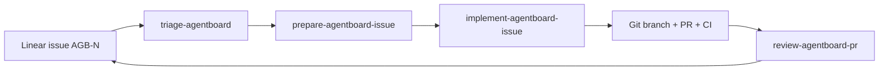

# Linear Agent Automation Design

**Spec**: `.specs/features/linear-agent-automation/spec.md`
**Status**: Approved (the user explicitly recommended this architecture)

## Architecture Overview

Use repository-scoped instruction-only skills as the orchestration layer. Each skill reads/writes task state through Linear MCP and reads/writes delivery state through local Git plus GitHub. The tracker boundary is explicit; no mirrored GitHub Issue labels are maintained.

## Approach Selection

| Approach | Trade-off | Decision |
| --- | --- | --- |
| Linear canonical; GitHub for delivery | Requires two authenticated surfaces but has one task-state authority | Selected; explicitly recommended by user |
| Mirror status in Linear and GitHub labels | More visible in GitHub but creates drift and retry ambiguity | Rejected |
| Keep GitHub Issues canonical and link Linear | Reuses old skills but leaves the real board stale | Rejected |

## Code Reuse Analysis

| Existing component | Location | How it is used |
| --- | --- | --- |
| Existing four workflow definitions | `.claude/skills/*/SKILL.md` | Preserve project-specific checks and safety constraints while changing discovery location and tracker operations. |
| CI job names | `.github/workflows/ci.yml` | Exact required status contexts for branch protection. |
| Repository commands | `AGENTS.md`, `README.md`, `Makefile` | Canonical verification commands in preparation and implementation handoffs. |
| TLC harness configuration | `.tlc/harness/config.json` | Preserve gates and subagent policy; exclude only runtime state. |

## Components

### Repository skills

- **Purpose**: Encode triage, preparation, implementation, and review transitions.
- **Location**: `.agents/skills/<skill-name>/SKILL.md`
- **Interfaces**: Linear issue identifier `AGB-N`; PR number for review.
- **Dependencies**: Linear MCP, local Git, GitHub read/write surface.
- **Reuses**: Existing project commands and conventions.

### Linear board metadata

- **Purpose**: Express readiness, blocking, specification, human gate, and risk independently of workflow state.
- **Location**: AgentBoard team in Linear.
- **Interfaces**: Issue labels, comments, state, relations, and an issue template.
- **Dependencies**: Authenticated Linear MCP or UI for template creation.

### GitHub merge gate

- **Purpose**: Prevent merge while backend or frontend CI is failing.
- **Location**: `main` branch protection/ruleset for `juliovinnicius/agentboard`.
- **Interfaces**: Exact check contexts from `.github/workflows/ci.yml`.
- **Dependencies**: GitHub administration permission.

## Error Handling Strategy

| Error scenario | Handling | Result |
| --- | --- | --- |
| Linear unavailable | Stop before transition; provide reconnection action | No GitHub-Issue fallback or state drift |
| GitHub admin unavailable | Leave AGB-10 open and record the missing protection gate | CI implementation is not falsely marked complete |
| Partial external write | Re-read both systems and continue only from verified state | Retry is safe and auditable |
| Product scope absent | Label/comment AGB-7 instead of filling product choices | Domain remains intentionally undefined |

## Risks & Concerns

| Concern | Location | Impact | Mitigation |
| --- | --- | --- | --- |
| Three skills still target GitHub Issues | `.claude/skills/*/SKILL.md` | Linear board never advances | Replace task operations with named Linear MCP calls and remove GitHub Issue semantics. |
| Skills are outside Codex repository discovery | `.claude/skills/` | Codex cannot invoke them automatically | Move the final skill folders to `.agents/skills`. |
| `main` is unprotected | GitHub branch metadata | Red CI does not block merge | Require both exact CI job names and PR review. |
| GitHub CLI token is invalid | Local `gh auth status` | CLI cannot administer branch or publish PR | Use authenticated browser; if unavailable, leave a precise blocker and compare URL. |
| Linear connector has no template-create operation | Connected MCP surface | Template cannot be created semantically through MCP | Attempt authenticated Linear UI; otherwise report one remaining manual step. |
| No behavior test harness exists for Markdown skills | Repository | Wording-only validation can miss unsafe transitions | Validate structural invariants, exercise a scratch mutation sensor, and run an independent verifier. |

## Tech Decisions

| Decision | Choice | Rationale |
| --- | --- | --- |
| Skill structure | Four small instruction-only skills | The workflows are distinct and do not justify scripts/assets. |
| Tracker integration | Name the exact `mcp__linear__*` operations but require capability discovery | Prevents silent fallback while tolerating connector evolution. |
| Completion evidence | Linear comment with commands/check URLs and PR link | Keeps the canonical issue auditable. |
| Branch policy | Required PR plus strict backend/frontend checks; no force push/delete | Matches the safe gate requested. |
